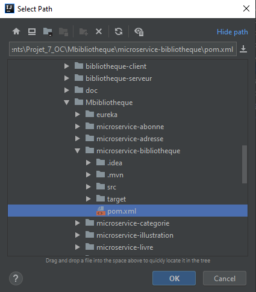
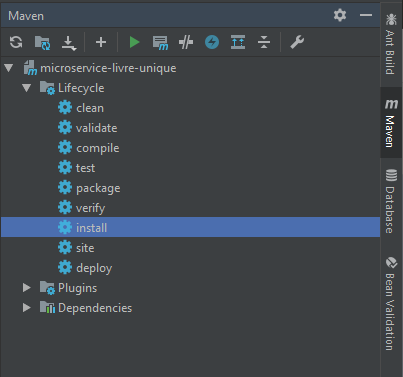

##  Mettre en place l'application
   
####  1) Créer la base de données :

   1. Faire un backup de la base de données avec le fichier SQL/backup.
    

#   Mettre en place les microservices :

  #####Ouvrir le dossier Microservice via son IDE
  
  ##  Mettre en place eureka avant les microservices, celui-ci s'implèmente de la même façon que les microservices.
    
   ####Action demandé pour chaque microservice : 
   
   Via Maven sélectionner le pom.xml du microservice via "Add Maven project" 
   
   
   
    
    Dans le Project Structure / Modules
        définir dans src/main le dossier java comme Source
        et le resources comme Resources
 
   
   
   
   Via Maven effectuer un download des sources pour vérifier que vous possèdez bien toutes les dépendances.
   
   
   
   Via Maven faire un install du microservice
   
   
   
   
   Pour faire fonctionner les microservices, vous devez lancer eureka dans un premier temps.
    
   Une fois les eureka et les microservices lancés vous pouvez lancer Zuul
   
   
   # Mettre en place la partie client "alegia"
   
   
   1. Effectuer les mêmes actions que pour un microservice.
   2. Les microservices doivent être lancés pour consulter le site.
   3. Modifier l'url des interfaces pour les microservices qui fonctionne avec l'ip d'un autre ordinateur,
   les remplacer par localhost.
   4. Modifier la variable filePath dans la classe GestionSiteAction, remplacer par le chemin de votre ordinateur pour aller au projet
   
   
   
   # Informations supplémentaire
   
   Mot de passe du certificat de SSL : Yocorps17   
   Compte employé : el-rambo-poto@hotmail.fr   
   mot de passe : 123   
   
  
  # Test d'intégrations
  Pour lancer les tests des microservices sur votre machine suivre ces étapes :
  - Installer Node.js 
  - Installer newman avec la commande suivante : npm install -g newman
  - Se placer dans le fichier principal du projet.
  - Lancer la commande suivante : newman run tests/alegia_test.postman_collection.json